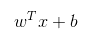
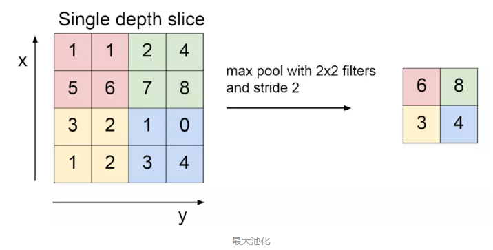

## wadas Tech Wiki

## Faster Rcnn tf

项目代码：https://github.com/endernewton/tf-faster-rcnn 

搭建的环境是Ubuntu：16.04 Python3.6 Tensorflow 1.9 GPU模式。在VGG16数据集上训练。训练结果打包成pb文件，采用
tensorflow/serving 和 flask Restful提供服务。

对于训练好的tensorflow模型，有三种常用的打包方式，第一种，打包成ckpt；第二种打包成fronze_model；第三种打包成saved_model.

### Faster Rcnn学习

一文读懂Faster Rcnn：https://zhuanlan.zhihu.com/p/31426458


tf-faster-rcnn打包saved_model文件：
```python
from tensorflow import saved_model as sm
#graph_def = sess.graph.as_graph_def()
export_path = './saved_model/'                      # 设置文件路径
builder = sm.builder.SavedModelBuilder(export_path)

# 输入与输出
tf_input = {
            'input0' : tf.saved_model.utils.build_tensor_info(net._image),
            'input1' : tf.saved_model.utils.build_tensor_info(net._im_info)
           }
tf_output = {
             'output0' : tf.saved_model.utils.build_tensor_info(net._predictions["cls_score"]),
             'output1' : tf.saved_model.utils.build_tensor_info(net._predictions["cls_prob"]),
             'output2' : tf.saved_model.utils.build_tensor_info(net._predictions["bbox_pred"]),
             'output3' : tf.saved_model.utils.build_tensor_info(net._predictions["rois"])
            }

# 构造签名
prediction_signature = (
    tf.saved_model.signature_def_utils.build_signature_def(
        tf_input,tf_output,
        method_name=tf.saved_model.signature_constants.PREDICT_METHOD_NAME))

builder.add_meta_graph_and_variables(sess, [tf.saved_model.tag_constants.SERVING], signature_def_map={'tf_faster_rcnn_cls': prediction_signature})
builder.save()
print("Saved Model succeed!")
```

#### CNN学习 

https://www.jianshu.com/p/da0c4cc76a06

CNN卷积神经网络，CNN一共有卷积层（CONV）、ReLU层（ReLU）、池化层（Pooling）、全连接层（FC（Full Connection））

##### CONV层：

卷积，尤其是图像的卷积，需要一个滤波器，用滤波器对整个图像进行遍历，我们假设有一个32*32*3的原始图像A，滤波器的尺寸为5*5*3，用w表示，滤波器中的数据就是CNN的参数的一部分，那么在使用滤波器w对A进行滤波的话，可以用下面的式子表示：

其中x为原始图像的5*5*3的一部分，b是偏置项置为1。在对A进行滤波之后，产生的是一个28*28*1的数据。那么假设我们存在6个滤波器，这六个滤波器之间彼此是独立的，也就是他们内部的数据是不同的且没有相关性的。可以理解为一个滤波器查找整幅图像的垂直边缘，一个查找水平边缘，一个查找红色，一个查找黑色这样。那么我就可以产生6个28*28*1的数据，将它们组合到一起就可以产生28*28*6的数据，这就是卷积层主要做的工作。

特别要注意的是滤波器的深度一定要与上一层传来的数据的深度相同，就像上图的第二个卷积层在处理传来的28*28*6的数据时要使用5*5*6的滤波器.
当图像大小是N，滤波器尺寸为F时，步长S，那么卷积后大小为（N-F）/S+1
卷积层输入W1*H1*D1大小的数据，输出W2*H2*D2的数据，此时的卷积层共有4个超参数：
K：滤波器个数
P：pad属性值
S：滤波器每次移动的步长
F：滤波器尺寸
此时输出的大小可以用输入和超参计算得到：
W2=（W1-F+2P）/S+1
H2=（H1-F+2P）/S+1
D2=D1

1\*1的滤波器也是有意义的，它在深度方向做卷积，例如1\*1\*64的滤波器对56\*56\*64的数据卷积得到56\*56的数据

##### ReLU层：

激活函数，对于每一个维度经过ReLU函数输出即可。不改变数据的空间尺度。

##### Pooling池化层

通过pad操作，输出图像在控件上并没有变化，但是深度发生了变化，越来越庞大的数据给计算带来了困难，也出现了冗余的特征，所以需要进行池化操作，池化不改变深度，只改变长宽，主要有最大值和均值两种方法，一般的池化滤波器大小F为2步长为2，对于最大值池化可以用下面的图像清晰的表示



#### Tensorflow slim库

